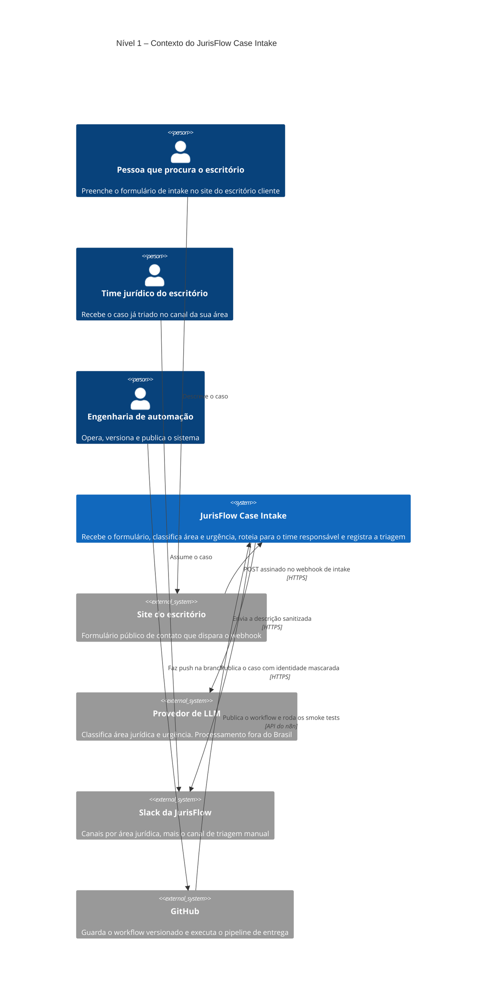

# C4 nível 1 – Contexto

Quem usa o JurisFlow Case Intake e com que sistemas ele conversa. Este nível responde à
pergunta de negócio: o que entra, o que sai e quem depende disso.

## Fronteiras que este diagrama deixa explícitas

O dado pessoal entra por uma única porta, que é o webhook autenticado, e sai por duas: o
provedor de LLM, que recebe a descrição sanitizada, e o Slack, que recebe a descrição íntegra
com nome e CPF mascarados. Toda discussão de conformidade da Etapa 2 acontece nessas duas
setas.

O GitHub aparece como sistema externo de propósito. Ele não participa do fluxo de negócio,
apenas publica a configuração, e essa separação é o que permite dizer que o *deploy* é
automatizado sem que a entrega dependa de quem está no teclado.
