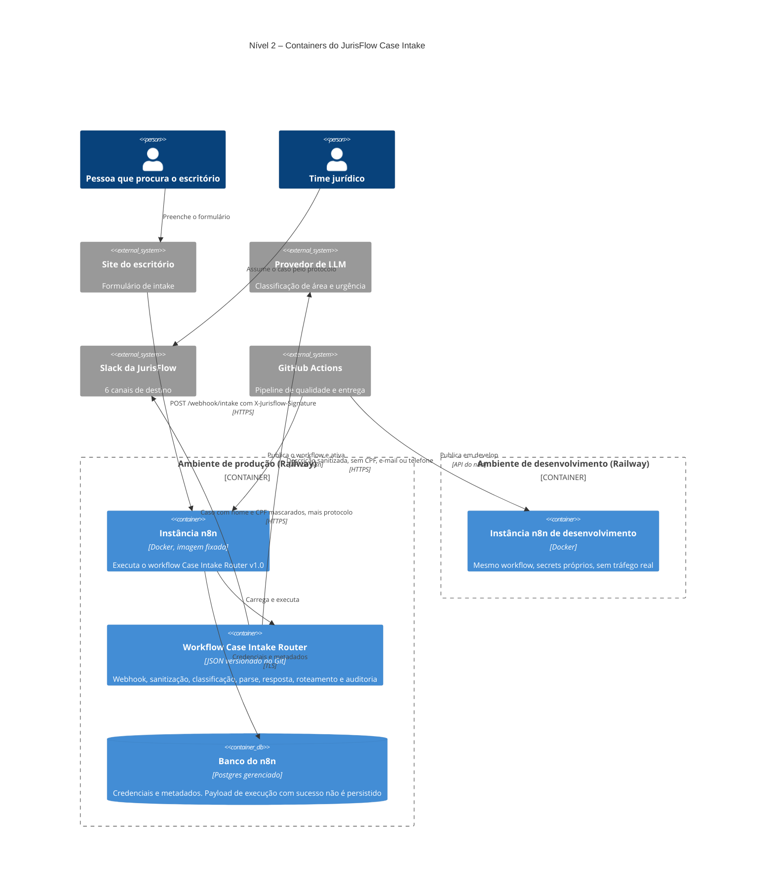
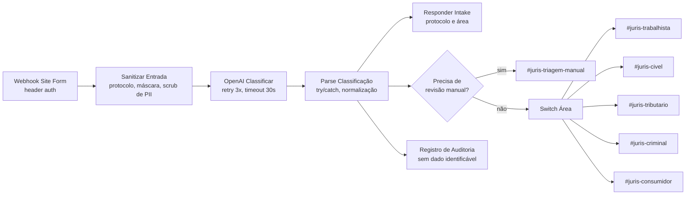

# C4 nível 2 – Containers

Como o JurisFlow Case Intake está montado por dentro, e onde cada responsabilidade mora.

## Caminho de uma requisição

## Decisões de desenho visíveis no diagrama

A sanitização vem antes da chamada ao modelo, e não depois, porque o objetivo é que o dado
identificável simplesmente não chegue ao provedor.

A resposta ao formulário sai logo após o parse, em paralelo ao roteamento, de modo que o site
recebe o protocolo e a área sem esperar a entrega no Slack. Isso corrige o achado CONF-04,
em que o formulário recebia sucesso mesmo quando o processamento falhava adiante.

O desvio de revisão manual existe para tornar visível o que antes era silencioso. Toda
classificação que o sistema não reconhece vai para um canal próprio, em vez de ser empurrada
para o Cível como acontecia no protótipo.
